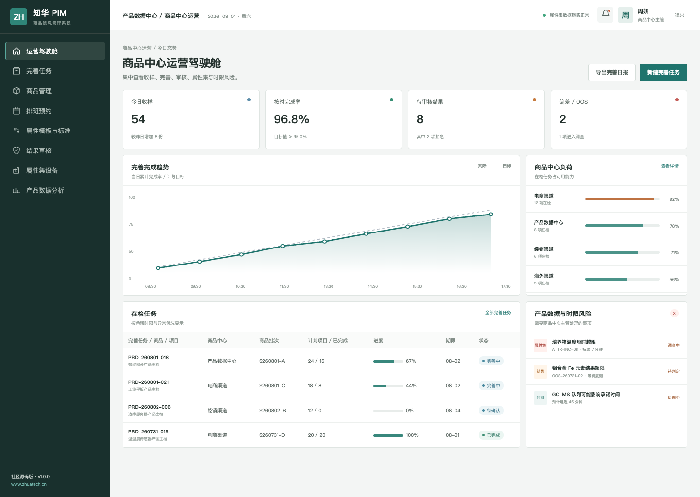
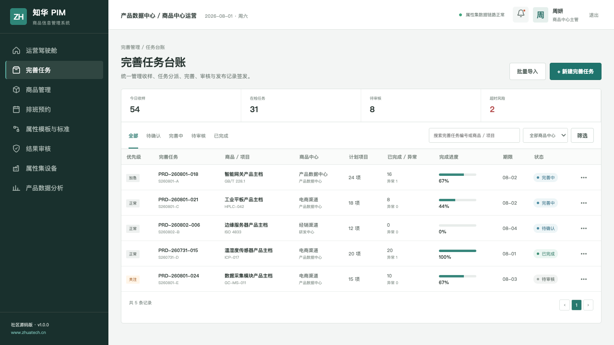
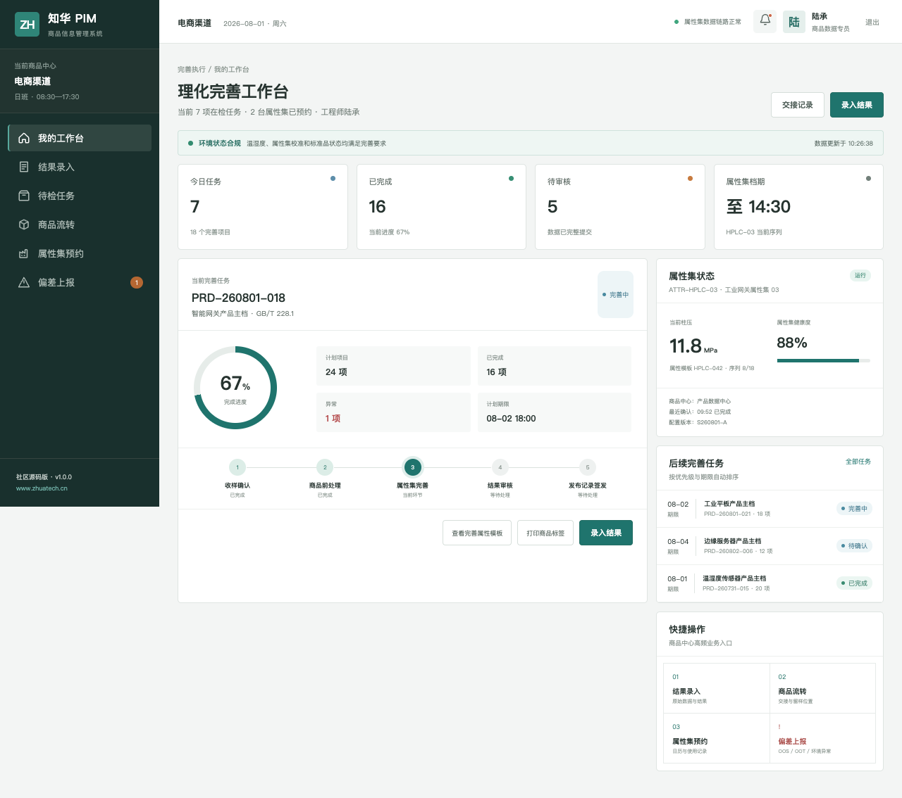

# 知华科技 ZhuaTech PIM

**产品信息管理系统 · Community Source Edition**

[](backend/pom.xml) [](frontend/package.json) [](compose.yaml) [](LICENSE)

用统一产品主档承接属性治理、内容完善和多渠道发布。

这是上海如静知华信息科技有限公司提供的企业应用工程示例，官网：[www.zhuatech.cn](https://www.zhuatech.cn/)。仓库重点呈现一套能启动、能测试、有数据库迁移、有角色权限、有管理端与岗位端的完整应用骨架。

## 场景切片

### 商品数据运营驾驶舱



### 商品完善任务队列



### 商品数据专员工作台



## 系统覆盖什么

1. 产品主档、属性集与分类体系
2. 完整度校验、富媒体内容与审核任务
3. 渠道映射、发布记录与数据质量分析

业务链路：`主档接入 → 属性校验 → 内容完善 → 数据审核 → 渠道发布 → 质量回溯`

## 面向开发者

| 部分 | 技术与职责 |
| --- | --- |
| 后端 | Java 21、Spring Boot、Spring Security、JPA、Flyway |
| 前端 | Vue 3、Pinia、Vue Router、Axios、Vite，响应式管理端与 H5 岗位端 |
| 数据 | MySQL 8；H2 集成测试 |
| 交付 | Docker Compose、Nginx、环境变量配置 |

Java 工程包名为 `cn.zhuatech.pim`，数据库名为 `zhuatech_pim`。角色覆盖商品数据专员、PIM 经理、审核人、系统管理员。

### 目录

- `backend/`：REST API、JWT、领域模型、Flyway 与测试
- `frontend/`：Vue 管理端、响应式 H5 工作台与演示数据
- `docs/`：架构、接口、数据库说明与页面截图
- `compose.yaml`：MySQL、Java 服务与 Nginx 一键编排

## 快速上手

仅看演示界面：

```bash
cd frontend
npm install
npm run dev:demo
```

打开 `http://localhost:5173`。管理端账号 `planner / Demo@2026`，岗位端账号 `operator / Demo@2026`。

完整启动：

```bash
cp .env.example .env
# 修改数据库密码与 JWT_SECRET
docker compose up --build
```

## 上线检查

仓库中的账号、客户、指标、工单和经营数据均为虚构演示数据。正式落地时应更换默认密码与 JWT 密钥，配置 HTTPS、最小权限、数据库备份、操作审计、脱敏策略，并按照所在行业完成安全与合规评估。

## 非商业许可

本工程仅允许个人、非商业性的学习、研究和技术交流，**不得商用**。企业内部使用、生产部署、SaaS、客户交付、收费培训、咨询实施及品牌替换，均须事先取得上海如静知华信息科技有限公司书面授权。完整条款见 [LICENSE](LICENSE)。

需要深度开发、私有化部署、系统集成或商业授权，请访问[知华科技官网](https://www.zhuatech.cn/)，也可扫码添加微信咨询：

| 微信咨询 1 | 微信咨询 2 |
| --- | --- |
|  |  |

相关检索：PIM 源码、商品信息管理、产品主数据、渠道发布、Java PIM、Vue PIM、上海如静知华信息科技有限公司。
